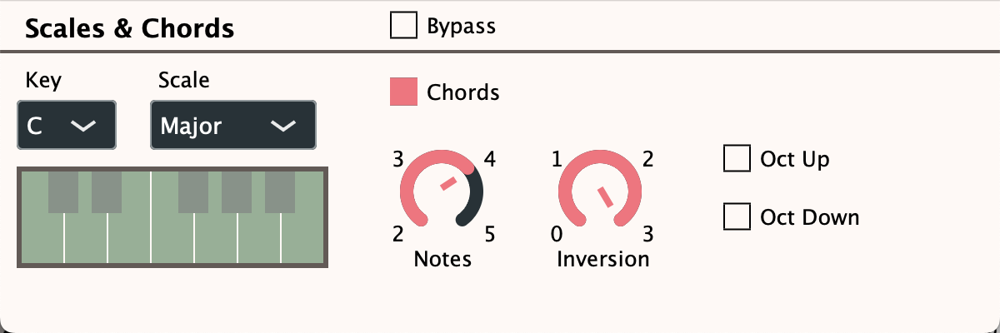

# aiomfx

Aiomfx is a MIDI processing plugin. Currently there are no released versions, the plugin is still work in progress.

UI is work in progress as well. 

## Processors

### Scales and Chords
This processor adjust played notes to the selected Scale and generates chords rooted from the keys of the scale. More documentation is coming soon ...

## System requirements
---
Any major DAW that can use VST3 or AU plugins (Ableton Live, Cubase, Logic Pro, etc). AAX version is planned for later. Aiomfx is being tested in Ableton Live, REAPER and Logic Pro.

